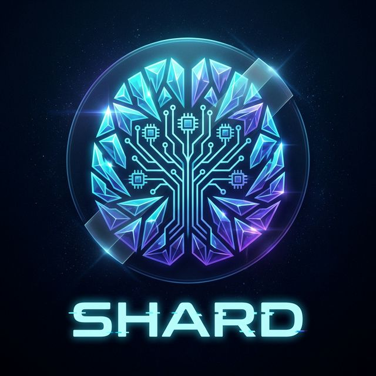
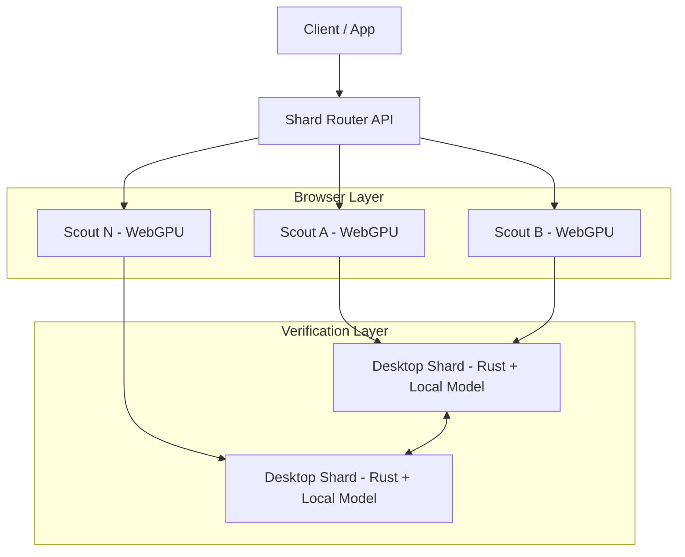

<p align="center">
  
</p>

<h1 align="center">Shard: Browser-Powered Distributed Inference</h1>

<p align="center">
  <strong>Instantly pool browser and desktop GPU compute for LLM inference—no centralized cluster, no waiting room.</strong><br>
  <strong>Shard combines a Next.js/WebGPU edge swarm with a fault-tolerant Rust P2P backbone to deliver low-latency, verifiable generation at internet scale.</strong>
</p>

[](LICENSE)
[](https://www.python.org/downloads/)
[](https://www.rust-lang.org/)
[](https://nodejs.org/)

---

## Why Shard, Why Now?

Shard is the decentralized inference network for developers who are done waiting on rented GPU queues and fragile single-region deployments.

Built by the creator of **PolyCode** and **PolyCouncil**, Shard is designed to ship fast, harden quickly, and turn idle user hardware into real inference throughput.

- **Scouts (browser nodes):** One click, zero install, WebGPU speculative token drafting.
- **Shards (desktop/server nodes):** Rust + local model verification for correctness and final output.
- **Consumers (any client):** OpenAI-compatible API access routed through a resilient P2P swarm.

---

## Shard vs. Petals

| Dimension | Shard | Petals (legacy baseline) |
|---|---|---|
| Scout onboarding | **Zero friction:** join from browser via Next.js + WebGPU | Requires Python environment and model/runtime setup |
| Runtime topology | **Hybrid speculative architecture:** WebGPU Scouts + desktop Shards | Primarily Python-hosted transformer segments |
| Trust + validation | **Desktop Shards verify speculative drafts before commit** | Relies on volunteer-host chain behavior |
| Network core | **Fault-tolerant Rust P2P backend** (libp2p, resilient peer routing) | Python-centric distributed orchestration |
| UX for contributors | **No Docker/Python required** for browser Scouts | Contributor onboarding is heavier |
| Product posture | Built for mainstream web-native compute pooling | Built for research-first collaborative serving |

**Translation:** Petals proved decentralized inference is possible. **Shard makes it usable at scale for normal developers and normal users.**

---

## Architecture (Hybrid Speculative Inference)

> 📌 **Architecture Diagram Placeholder**<br>
> `docs/assets/architecture-diagram.png` *(coming soon)*

> 📌 **Proof of Compute GIF Placeholder**<br>
> `docs/assets/proof-of-compute.gif` *(coming soon)*



---

## Developer API: Drop-In Python SDK

Shard ships a drop-in style API so teams can move from local Hugging Face inference to swarm-routed inference with minimal code changes.

### Install

```bash
pip install shard-client
```

### Replace Hugging Face `AutoModelForCausalLM` with `ShardDistributedModel`

```python
import asyncio
from transformers import AutoTokenizer
from shard_client import ShardDistributedModel

MODEL_ID = "meta-llama/Llama-3.1-8B-Instruct"

async def main() -> None:
    # Keep your tokenizer workflow.
    tokenizer = AutoTokenizer.from_pretrained(MODEL_ID)

    # Drop-in distributed model: routes generation to local Shard router/swarm.
    model = ShardDistributedModel.from_pretrained(
        MODEL_ID,
        router_url="http://127.0.0.1:9091",
        websocket_url="ws://127.0.0.1:9091/ws/generate",
        tokenizer_name=MODEL_ID,
        transport="websocket",  # or "http_poll"
    )

    prompt = "Explain speculative decoding in one paragraph."
    output = await model.generate(prompt, max_new_tokens=128)
    print(output)

    await model.aclose()

if __name__ == "__main__":
    asyncio.run(main())
```

✅ Same developer ergonomics.<br>
✅ Distributed compute instead of single-box inference.<br>
✅ Instant path from prototype to decentralized production.

See [`python-sdk/README.md`](python-sdk/README.md) for additional examples.

---

## Quick Start

### Prerequisites
- Rust 1.75+
- Python 3.11+
- Node.js 18+

### 1) Build Rust sidecar

```bash
cd desktop/rust
cargo build --release
```

### 2) Run core services

```bash
# terminal 1
./desktop/rust/target/release/shard-daemon

# terminal 2
cd desktop/python && pip install -r requirements.txt && python run.py

# terminal 3
cd web && npm install && npm run dev
```

Open: `http://localhost:3000`

---

## Project Structure

- `web/` — Next.js app and browser Scout node
- `desktop/rust/` — Rust P2P daemon and transport fabric
- `desktop/python/` — orchestration and OpenAI-compatible API
- `python-sdk/` — drop-in client SDK (`ShardDistributedModel`)
- `docs/` — architecture, audits, deployment, and whitepaper

---

## Contributing

- 🐛 Issues: <https://github.com/ShardNetwork/Shard/issues>
- 💬 Discussions: <https://github.com/ShardNetwork/Shard/discussions>
- 📘 Guide: [`CONTRIBUTING.md`](CONTRIBUTING.md)

If you care about open inference, real decentralization, and web-native GPU compute, you’re in the right place.
