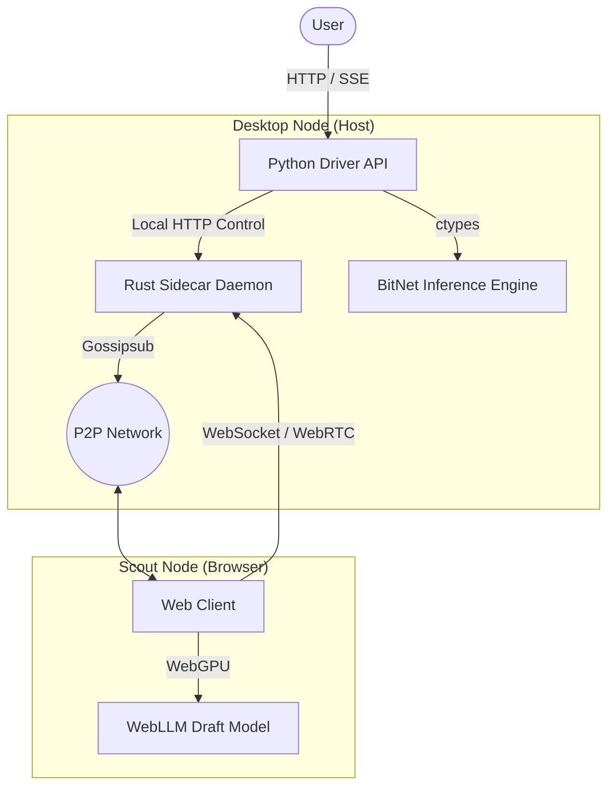

<p align="center">
  
</p>

<h1 align="center">Shard: Hybrid Distributed Inference Network</h1>

<p align="center">
  <strong>Free, unlimited LLM access powered by a decentralized P2P inference mesh.</strong><br>
  <em>Contribute compute, earn priority.</em>
</p>

[](LICENSE)
[](https://www.python.org/downloads/)
[](https://www.rust-lang.org/)
[](https://nodejs.org/)
[](http://makeapullrequest.com)
[](https://github.com/TrentPierce/Shard/actions/workflows/ci.yml)

---

## 📂 Project Structure

Verified, production-ready organization:

- **`desktop/`**: Core application logic.
  - **`rust/`**: High-performance P2P networking daemon (the "Sidecar").
  - **`python/`**: AI Orchestration, API endpoints, and Logic (the "Shard").
- **`web/`**: Next.js user-facing web client and "Scout" node implementation.
- **`cpp/`**: Native bindings for hardware-accelerated inference (e.g., BitNet).
- **`docs/`**: Comprehensive documentation, architecture diagrams, and audit reports.
- **`scripts/`**: Build scripts, utility tools, and packed environment helpers.
- **`tests/`**: Integration and unit tests.

---

## 🏗️ Architecture

Shard uses a hybrid architecture combining a local Python/Rust desktop node with a browser-based distributed mesh.



For a detailed technical analysis, see the [White Paper](docs/Shard-White-Paper-Feb-2026.pdf) and [System Diagram](docs/system-diagram.md).

### Node Roles

| Class | Name | Hardware | Role |
|-------|------|----------|------|
| **A** | **Shard** | Desktop/Server (GPU) | Full model host, verifies draft tokens from Scouts. |
| **B** | **Scout** | Browser (WebGPU) | Runs tiny draft model, submits speculative tokens. |
| **C** | **Consumer** | Any Device | Pure consumer, queued behind contributors. |

---

## 📚 Documentation

- **[API Reference](docs/API.md)**: Details on the OpenAI-compatible endpoints.
- **[Parallel Execution Plan](docs/PARALLEL_EXECUTION_PLAN.md)**: How we scale inference execution.
- **[Audit Report](docs/AUDIT_REPORT.md)**: Security and performance audit findings.
- **[Agents & AI](docs/agents.md)**: Information on the AI agents involved.
- **[Build Report](docs/build_report.md)**: Latest build status and metrics.
- **[Production Readiness](docs/production-readiness-plan.md)**: Roadmap to production.
- **[Deployment Guide](docs/deployment-guide.md)**: How to deploy Shard.

---

## 🚀 Quick Start

### Prerequisites
- **Rust** (1.75+)
- **Python** (3.11+)
- **Node.js** (18+)

### 1. Build the Rust Daemon
```bash
cd desktop/rust
cargo build --release
# Output: desktop/rust/target/release/shard-daemon.exe
```

### 2. Start the components
**Terminal 1 (Rust Daemon):**
```bash
./desktop/rust/target/release/shard-daemon
```

**Terminal 2 (Python API):**
```bash
cd desktop/python
pip install -r requirements.txt
python run.py
```

**Terminal 3 (Web Client):**
```bash
cd web
npm install
npm run dev
# Open http://localhost:3000
```

---

## 🧩 Core Components

### Python Driver API (`desktop/python/`)
The brain of the operation.
- **Starts** the Uvicorn server.
- **Exposes** OpenAI-compatible `POST /v1/chat/completions`.
- **Manages** the "Cooperative Generation" loop.
- **Verifies** tokens using the local BitNet model.

### Rust Sidecar (`desktop/rust/`)
The nervous system.
- **Handles** all P2P networking (libp2p).
- **Broadcasts** work to the mesh via Gossipsub.
- **Discovers** peers via MDNS and DHT.
- **Bridge** to the browser via WebSocket/WebRTC.

### Web Client (`web/`)
The face and the swarm.
- **Interface**: Clean, modern chat UI.
- **Scout**: Uses WebLLM to generate draft tokens in the background.
- **Connects**: Directly to the local Rust daemon.

---

## 🤝 Contributing

We welcome contributions! Please see our **[Contributing Guide](CONTRIBUTING.md)**.

- 🐛 **[Report Issues](https://github.com/ShardNetwork/Shard/issues)**
- 💡 **[Feature Requests](https://github.com/ShardNetwork/Shard/discussions)**

---

## 🗺️ Roadmap

See [`CHANGELOG.md`](CHANGELOG.md) for history.

- [x] **v0.4.0**: P2P Networking & Basic Verification.
- [ ] **v0.5.0**: Full WebLLM Integration & Real BitNet Model.
- [ ] **v0.6.0**: Golden Ticket Sybil Prevention & gRPC.
- [ ] **v1.0.0**: Mainnet Launch.

---

## 🔐 Security & Operations

- **Security Controls**: API Keys, Rate Limiting (see [API Docs](docs/API.md)).
- **Troubleshooting**: [Guide](docs/troubleshooting.md).
- **Network Topology**: [Docs](docs/network-topology-and-scaling.md).

For the full White Paper, see [`docs/Shard-White-Paper-Feb-2026.pdf`](docs/Shard-White-Paper-Feb-2026.pdf).
