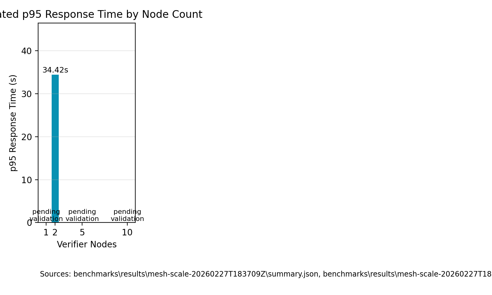
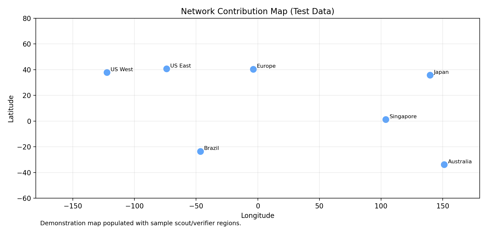
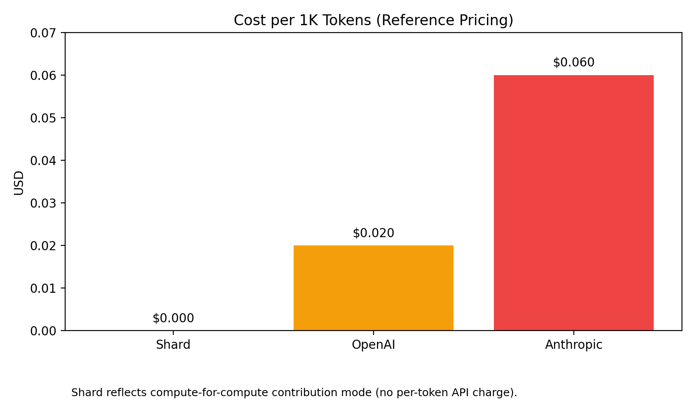

<div align="center">
  
  <h1>Shard Network</h1>
  <p><strong>Distributed AI inference with browser Scouts + verifier nodes.</strong></p>
</div>

[](https://github.com/TrentPierce/Shard/actions/workflows/ci.yml)
[](https://github.com/TrentPierce/Shard/releases/tag/v0.6.2)
[](LICENSE)

## 10-Second Overview

`Shard` is a distributed inference mesh:

- `Scouts` (browser/WebGPU) generate fast draft tokens.
- `Verifiers` (daemon nodes) validate and stream final responses.
- You get OpenAI-compatible APIs with overflow + SLA controls while reducing centralized API spend.

## Contribute In < 60 Seconds

### Scout (no install)

1. Open `https://shardnetwork.live`
2. Click `Join` / `Start Contributing`
3. Keep tab open to contribute browser compute

### Verifier (Docker)

```bash
git clone https://github.com/TrentPierce/Shard.git
cd Shard
docker compose up --build shard-daemon -d
curl http://localhost:9091/health
```

Required ports for public participation: `4001/tcp`, `9091/tcp`, `9090/udp`, `9092/udp`.

## Install & Setup Paths

- Desktop installers: see [Releases](https://github.com/TrentPierce/Shard/releases/tag/v0.6.2)
- Web app local:
```bash
cd web
npm install
npm run dev
```
- Python SDK:
```bash
cd sdk/python
pip install -e .
```

## Why It Matters

- Cost control: contribution mode avoids per-token API billing.
- Scale resilience: add distributed scout/verifier capacity during load spikes.
- Ownership: run your own inference fabric and policy controls.

## Compute-for-Compute Model

- Contribute compute capacity (Scout or Verifier).
- Receive network utility by drawing on shared compute when needed.
- You can participate today without token requirements.

## Shard Value Dashboard

Performance visualization, network map, and cost comparison:

- Performance chart now uses validated benchmark summaries only.
- Node counts without measured runs (`1`, `5`, `10`) are marked `pending validation` instead of estimated.
- Phase 3/4 summary in the PDF reflects current recorded metrics (including failed gates when present).







One-page summary PDF: [`docs/assets/value-dashboard/shard-value-summary.pdf`](docs/assets/value-dashboard/shard-value-summary.pdf)

## Repo Structure

- `desktop/rust/`: verifier daemon (libp2p mesh, API, bootstrap ring, policy controls)
- `web/`: Next.js Scout UI + telemetry
- `sdk/python/`: typed Python SDK
- `benchmarks/`: benchmark harness + distributed orchestrator
- `integrations/`: overflow router (circuit breaker + SLA enforcer)
- `deploy/`: Docker, Terraform, Kubernetes, monitoring assets

## Validation Commands

```bash
python scripts/verify_versions.py
cd desktop/rust && cargo test --all-targets && cargo clippy -- -D warnings
pytest tests/test_verification.py --cov --cov-fail-under=95
pytest sdk/python/tests/ --cov=sdk/python/shard --cov-fail-under=90 -q
cd web && npm test -- --passWithNoTests
```

## Documentation

- Architecture: `docs/architecture.md`
- Deployment: `docs/deployment.md`
- Verification protocol: `docs/verification-protocol.md`
- Tensor parallelism: `docs/tensor-parallelism.md`
- Enterprise VPC mode: `docs/enterprise-vpc-deployment.md`
- SLA definition: `docs/sla.md`
- Contributing: `docs/contributing.md`

## License

Business Source License 1.1 (BSL 1.1). See `LICENSE`.
