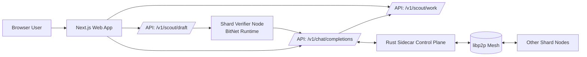

<div align="center">
  
  <h1>Shard</h1>
  <h3>Browser-Powered Distributed Inference</h3>
  <p>
    Free, unlimited LLM access through a decentralized P2P mesh.<br/>
    Contribute compute from your browser. Earn priority access.
  </p>

  <br/>

  [](https://github.com/TrentPierce/Shard/actions/workflows/ci.yml)
  [](LICENSE)
  [](#)
  [](CONTRIBUTING.md)
  [](https://github.com/TrentPierce/Shard)

  <br/>

  [**Live Demo**](https://shard-trents-projects-20e9a51a.vercel.app) · [**White Paper**](docs/Shard-White-Paper-Feb-2026.pdf) · [**API Docs**](docs/API.md) · [**Get Started**](#quick-start)
</div>

---

## What Is Shard?

Shard is a **hybrid distributed inference network** that turns every browser tab into an AI compute node. Instead of paying per token to a centralized provider, Shard creates a peer-to-peer mesh where:

- **Scouts** (browser nodes) run lightweight draft models via WebGPU
- **Shards** (desktop/server nodes) run full BitNet 1.58-bit models to verify drafts
- **Leeches** (passive users) consume AI without contributing compute

The result: **server-grade AI quality at zero cost**, powered by the collective compute of anyone who opens the webpage.

---

## Token & Affiliation Policy

- Shard is **not affiliated** with any external cryptocurrency, blockchain, or token project.
- Cryptography in this repository is used only for **node identity, proof-of-compute accounting, and internal anti-abuse controls**.
- The in-network credits are called **Shards**.
- Shards are an internal project credit unit for this network and are **not marketed as or intended to be an external token**.

---

## Why Shard?

| | Traditional Cloud AI | Shard Network |
|---|---|---|
| **💰 Cost** | $0.002–$0.06 / 1K tokens | Free (compute-for-access) |
| **🔒 Privacy** | Your data on someone else's server | Localhost-first routing |
| **📈 Scalability** | Buy more GPUs | More users = more GPUs |
| **🛡️ Resilience** | Single point of failure | Self-healing P2P mesh |
| **⚡ Latency** | Network RTT + queue wait | Local draft + network verification |
| **🔌 API** | Proprietary | OpenAI-compatible drop-in |

---

## How It Works


```mermaid
flowchart LR
    User[Browser User] --> Web[Next.js Web App]
    Web --> ChatAPI[/API: /v1/chat/completions/]

    ChatAPI --> WorkQ[/API: /v1/scout/work/]
    Web --> WorkQ
    Web --> DraftSubmit[/API: /v1/scout/draft/]
    DraftSubmit --> Verify[Shard Verifier Node\nBitNet Runtime]
    Verify --> ChatAPI

    ChatAPI <--> Sidecar[Rust Sidecar Control Plane]
    Sidecar <--> Mesh[(libp2p Mesh)]
    Mesh <--> Other[Other Shard Nodes]
```

1. **User sends a prompt** → routed to the Shard API
2. **Scouts generate draft tokens** → lightweight models run in-browser via WebGPU
3. **Shards verify drafts** → full BitNet model checks token quality in one parallel pass
4. **Verified tokens stream back** → statistically indistinguishable from a 70B-parameter model

> 📄 For the full technical deep-dive, read the [**White Paper**](docs/Shard-White-Paper-Feb-2026.pdf)

---

## Real-World Use Cases

- 🌐 **Community AI endpoint** — free chatbot powered by browser-contributed compute
- 🎓 **Classroom / lab** — student browsers act as Scouts, one workstation verifies
- 🚀 **Hackathon demo** — one EC2 verifier + attendee browser Scouts
- 🏢 **Internal overflow** — burst capacity when centralized GPU budget is exhausted

---

## New To Shard?

If you want a quick explanation of roles, contribution, and why distributed mode matters, start here:

- [`docs/join-network.md`](docs/join-network.md)
- [`docs/deployment-guide.md`](docs/deployment-guide.md)
- [`/network` leaderboard page](https://shard-trents-projects-20e9a51a.vercel.app/network)

---
## Quick Start

### Fastest Setup Paths

#### Join as Scout (browser contributor)
1. Open the deployed web app.
2. Allow WebGPU when prompted.
3. Keep the tab open; it contributes draft work automatically.

#### Run as Shard (one-command local stack)
```bash
docker compose up --build shard-daemon
```

Verify:
```bash
curl http://localhost:9091/health
curl http://localhost:9091/topology
```

### Run a Shard Node from Release Binary (v0.4.8+)

`v0.4.8` binaries include built-in public bootstrap peers. In most cases, you only need to run the binary.

#### Windows (PowerShell)
```powershell
& ".\shard-daemon-x86_64-pc-windows-msvc.exe"
# Or use helper script from this repo:
# installers\windows\start-shard.bat
```

#### Linux
```bash
chmod +x ./shard-daemon-x86_64-unknown-linux-gnu
./shard-daemon-x86_64-unknown-linux-gnu
# Or use helper script from this repo:
# installers/linux/start-shard.sh
```

#### macOS (Apple Silicon)
```bash
chmod +x ./shard-daemon-aarch64-apple-darwin
./shard-daemon-aarch64-apple-darwin
# Or use helper script from this repo:
# installers/macos/start-shard.sh
```

Quick check (daemon local control API):
```bash
curl http://127.0.0.1:9091/health
```

Wallet portability (move identity to a new machine):
```bash
# Export encrypted wallet backup from old node
SHARD_WALLET_PASSWORD='strong-password' ./shard-daemon wallet export --out ./my-wallet.shard-wallet --password-env SHARD_WALLET_PASSWORD

# Verify backup file
SHARD_WALLET_PASSWORD='strong-password' ./shard-daemon wallet verify-backup --in ./my-wallet.shard-wallet --password-env SHARD_WALLET_PASSWORD

# Import on new node (before starting daemon normally)
SHARD_WALLET_PASSWORD='strong-password' ./shard-daemon wallet import --in ./my-wallet.shard-wallet --password-env SHARD_WALLET_PASSWORD
```

### Wallets & Shards Credits

Show wallet address from the daemon:
```bash
./shard-daemon wallet show
```

Wallet API endpoint:
```bash
curl http://127.0.0.1:9091/wallet/address
```

Wallet storage path (`identity.json`):

- Windows: `%LOCALAPPDATA%\shard\identity.json`
- Linux: `~/.local/share/shard/identity.json`
- macOS: `~/Library/Application Support/shard/identity.json`

Check Shards balance:
```bash
# Replace <wallet> with your wallet address
curl http://127.0.0.1:9091/credits/<wallet>
```

Check a specific credit transaction:
```bash
# Replace <tx_id> with transaction id
curl http://127.0.0.1:9091/credits/tx/<tx_id>
```

Ledger diagnostics:
```bash
curl http://127.0.0.1:9091/ledger/head
curl http://127.0.0.1:9091/ledger/stats
curl "http://127.0.0.1:9091/ledger/export?from_height=1&limit=100"
```

Durable ledger files (auto-managed per node):

- `ledger.wal` (append-only signed transaction log)
- `ledger.snapshot.json` (periodic compact state snapshot)
- `ledger.meta.json` (schema + head metadata)

If API credit-gating is enabled, include your wallet on requests:
```bash
curl http://localhost:9091/v1/chat/completions \
  -H "Content-Type: application/json" \
  -H "X-Shard-Wallet: <wallet>" \
  -d '{"model":"shard-hybrid","messages":[{"role":"user","content":"Hello!"}]}'
```

#### Wallet Migration Example (Windows PowerShell)

```powershell
$env:SHARD_WALLET_PASSWORD = "strong-password"
.\shard-daemon.exe wallet export --out .\my-wallet.shard-wallet --password-env SHARD_WALLET_PASSWORD
.\shard-daemon.exe wallet verify-backup --in .\my-wallet.shard-wallet --password-env SHARD_WALLET_PASSWORD

# On new machine:
.\shard-daemon.exe wallet import --in .\my-wallet.shard-wallet --password-env SHARD_WALLET_PASSWORD
```

Keep your backup file and password separate. Anyone with both can control your wallet identity.

If port `4001` is already in use, launch with a different P2P port:
```powershell
# Windows
& ".\shard-daemon-x86_64-pc-windows-msvc.exe" --tcp-port 4011
```
```bash
# Linux/macOS
./<daemon-binary> --tcp-port 4011
```

### Prerequisites

- **Rust** 1.75+ — [rustup.rs](https://rustup.rs)
- **Node.js** 18+ with npm

### Web Client (Browser Scout)

```bash
cd web
npm install
npm run dev
# → http://localhost:3000
```

Deploy to Vercel using CLI:
```bash
cd web
npm run deploy:prod
```

Your browser enters **Scout mode** automatically — loading a draft model via WebGPU and contributing compute to the mesh.

Phase 4 browser layer hosting is enabled in the web client:

- The browser profiles WebGPU capabilities at boot.
- The browser registers a hosted layer slice with the Rust daemon.
- Activation payloads are obfuscated in transit and processed in a WebGPU pass-through stage before return.

<details>
<summary><strong>Desktop Shard Node (Rust Daemon)</strong></summary>

#### 1. Start the P2P Daemon

```bash
cd desktop/rust
cargo build --release
./target/release/shard-daemon \
  --control-port 9091 \
  --tcp-port 4001 \
  --webrtc-port 9090 \
  --quic-port 9092
```

The daemon currently exposes the primary API surface directly on the control port (including `/v1/chat/completions`).`r`n`r`n
</details>

<details>
<summary><strong>🐳 Docker Compose (All-in-One)</strong></summary>

```bash
# Start core services
docker-compose up --build

# With monitoring (Prometheus + Grafana)
docker-compose --profile monitoring up --build
```

Services:
| Service | Port | Description |
|---------|------|-------------|
| `shard-daemon` | 9091, 4001 | P2P networking (libp2p) |
| `prometheus` | 9095 | Metrics (monitoring profile) |
| `grafana` | 3001 | Dashboards (monitoring profile) |

Daemon observability endpoints:
- `GET /metrics` (Prometheus exposition)
- `GET /metrics/summary` (JSON summary for dashboards)
- `GET /dashboard` (auto-refresh operations dashboard)

Metrics persistence backends:
- `SHARD_METRICS_BACKEND=sqlite` (default, dev)
- `SHARD_METRICS_SQLITE_PATH=/path/to/metrics.db`
- `SHARD_METRICS_BACKEND=postgres` with `SHARD_METRICS_POSTGRES_URL=postgres://...`
- `SHARD_METRICS_BACKEND=none` (disable persistence)

</details>

<details>
<summary><strong>☁️ Join the Public Network</strong></summary>

Bootstrap peer:

```
/ip4/54.224.107.75/tcp/4001/p2p/12D3KooWPTDTQBH5JTCxhiaZuL9sr695UAEndMDRj9SJ9pi3agEq
```

```bash
./target/release/shard-daemon \
  --control-port 9091 \
  --tcp-port 4001 \
  --webrtc-port 9090 \
  --quic-port 9092 \
  --bootstrap /ip4/54.224.107.75/tcp/4001/p2p/12D3KooWPTDTQBH5JTCxhiaZuL9sr695UAEndMDRj9SJ9pi3agEq
```

</details>

---

## API Usage

Shard is **OpenAI-compatible** — use any existing client library:

```python
from openai import OpenAI

client = OpenAI(
    base_url="http://localhost:9091/v1",
    api_key="your-api-key",  # optional
)

response = client.chat.completions.create(
    model="shard-hybrid",
    messages=[{"role": "user", "content": "Explain quantum computing simply."}],
    stream=True,
)

for chunk in response:
    print(chunk.choices[0].delta.content or "", end="", flush=True)
```

```bash
# Or with cURL
curl http://localhost:9091/v1/chat/completions \
  -H "Content-Type: application/json" \
  -d '{"model": "shard-hybrid", "messages": [{"role": "user", "content": "Hello!"}]}'
```

> 📖 Full API reference: [**docs/API.md**](docs/API.md)

---

## Architecture

| Component | Language | Purpose |
|-----------|----------|---------|
| **Web Client** | TypeScript / React | Browser UI, WebLLM scout engine, P2P mesh |
| **Rust Daemon** | Rust (libp2p + axum) | P2P networking, peer discovery, control/API surface |

### Key Technologies

- **[BitNet b1.58](https://arxiv.org/abs/2402.17764)** — 1.58-bit ternary quantization (6–8x VRAM reduction)
- **[libp2p](https://libp2p.io/)** — Transport-agnostic P2P networking (TCP, WebSocket, WebRTC, QUIC)
- **[WebLLM](https://webllm.mlc.ai/)** — In-browser LLM inference via WebGPU
- **Hybrid Speculative Decoding** — Scout drafts + Shard verification in one parallel pass
- **Golden Ticket Protocol** — Sybil attack prevention via random audit injections

> 📐 Detailed architecture: [**docs/ARCHITECTURE.md**](docs/ARCHITECTURE.md)

---

## Response Quality

For non-Llama-3 models (e.g., TinyLlama GGUF):
```bash
SHARD_PROMPT_FORMAT=chatml
```

For Llama-3 chat models:
```bash
SHARD_PROMPT_FORMAT=llama3  # or 'auto' with matching model names
```

Fallback for generic instruct models:
```bash
SHARD_PROMPT_FORMAT=plain
```

---

## Python SDK

> ⚠️ **Experimental** — The Python SDK is currently in scaffolding stage.

```bash
cd python-sdk
pip install -e .
```

See [`python-sdk/README.md`](python-sdk/README.md) for transport assumptions and limitations.

---

## Contributing

We welcome contributions! See [**CONTRIBUTING.md**](CONTRIBUTING.md) for:

- Development workflow and branching strategy
- Style guides (Python, Rust, TypeScript)
- Testing requirements
- Commit message format

```bash
# Quick start for contributors
make setup    # Install all dependencies
make dev      # Start all services
make test     # Run all test suites
```

### Versioning

Shard uses a single source of truth in the root `VERSION` file.

```bash
make version         # show current version
make version-sync    # sync all package/app versions from VERSION
make version-set V=0.4.6
```

---

## Community

- 📋 [**Issues**](https://github.com/TrentPierce/Shard/issues) — Bug reports and feature requests
- 💬 [**Discussions**](https://github.com/TrentPierce/Shard/discussions) — Questions, ideas, general chat
- 📖 [**Docs**](docs/) — Architecture, deployment, troubleshooting
- 📜 [**Changelog**](CHANGELOG.md) — Version history

Issue templates are in [`.github/ISSUE_TEMPLATE/`](.github/ISSUE_TEMPLATE/).

---

## License

[Business Source License 1.1](LICENSE) — Free for non-competing use under 10K requests/month.  
Converts to Apache 2.0 on February 13, 2036.

---

<div align="center">
  <sub>Built with 🧊 by the <a href="https://github.com/TrentPierce/Shard">Shard</a> community</sub>
</div>


