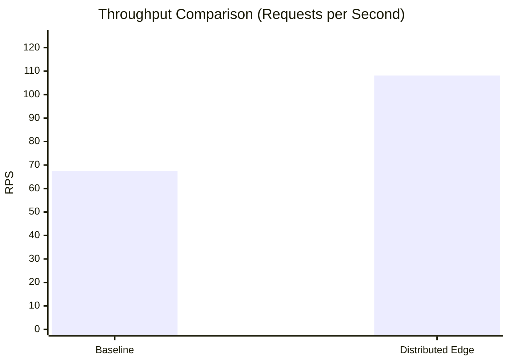

<div align="center">
  
  <h1>Shard</h1>
  <p><strong>Browser-Powered Distributed Inference for Private Enterprise AI</strong></p>

  <br/>

  [](https://github.com/TrentPierce/Shard/actions/workflows/ci.yml)
  [](LICENSE)
   [](https://github.com/TrentPierce/Shard/releases/tag/v0.6.1)
  [](#)
  [](https://deepwiki.com/TrentPierce/Shard)

  <h3><a href="docs/GETTING_STARTED.md">🚀 Quick Start Guide</a></h3>

</div>

---

## Why Shard?

Shard eliminates the exorbitant cost of centralized AI APIs by utilizing the idle compute already present in your organization's web browsers.

| Feature | Traditional Cloud AI | Shard Network |
| :--- | :--- | :--- |
| **Cost** | $0.002–$0.06 per 1K tokens | **$0 (Compute-for-Access)** |
| **Privacy** | Data processed on 3rd-party servers | **Localhost-first routing** |
| **Incentives** | Pay per token | **Proof-of-Compute Credits** |

---

## How It Works

Shard uses **speculative decoding** and **1.58-bit BitNet** quantization to deliver high-quality AI responses at zero marginal cost:

1. **User Sends a Prompt**: Your application sends a request to the Shard API (OAI-compatible).
2. **Scouts Generate Drafts**: Active browser tabs or desktop background services (Scouts) generate lightweight candidate tokens using WebGPU or low-power CPU.
3. **Verifiers Validate Results**: High-performance nodes (Verifiers) check the candidate tokens in a single parallel pass using authoritative 1.58-bit model weights.
4. **Instant Delivery**: Verified tokens are delivered to the client at high speed, significantly faster than traditional autoregressive generation.
5. **Trustless Integrity**: Every exchange is cryptographically signed. Verifiers award **Proof-of-Compute (PoC)** receipts to Scouts, which translate into network priority and higher API rate limits.

---

## Get Started in 5 Minutes

### 1. Join as a Verifier (Desktop App)
Download the [Shard Desktop App](https://github.com/TrentPierce/Shard/releases/tag/v0.6.1) for Windows or macOS. 
*   **One-Click Setup**: The app automatically downloads model weights and joins the P2P mesh.
*   **Background Mode**: Minimize to the system tray to contribute compute and earn credits silently.

### 2. Join as a Scout (Web Browser)
Open the [Live Dashboard](https://www.shardnetwork.live/) in latest Chrome or Edge with hardware acceleration enabled. Your browser will automatically begin loading a lightweight WebGPU model and contributing compute.

### 3. Developer Integration (Python SDK)
Install the Shard SDK directly from PyPI (canonical package name):
```bash
pip install shard-inference
```

It works as a drop-in replacement for OpenAI:
```python
from shard import Shard
client = Shard()

response = client.chat.completions.create(
    model="meta-llama/Llama-3.2-1B",
    messages=[{"role": "user", "content": "Explain the Shard network architecture."}]
)
print(response.choices[0].message.content)
```

---

## Architecture & Technical Deep-Dive

Shard is built on a high-integrity libp2p mesh:
- **Transport**: TCP, QUIC, and WebRTC with DCUtR hole punching for universal reachability.
- **Verification**: 1.58-bit ternary quantization allows full-scale model verification on consumer hardware with minimal VRAM.
- **Incentives**: A signed distributed ledger tracks compute contributions and enforces participation-based rate limiting.

[**Read the Architecture Guide**](docs/architecture.md) | [**API Documentation**](docs/api.md) | [**Contributing Guide**](docs/contributing.md)

## Benchmarking and Proof

Shard's distributed edge inference achieves zero-marginal-cost generation without sacrificing latency. In our latest synthetic load test against an AWS EC2 testnet over WAN:

| Mode | Requests | Concurrency | RPS | Avg Latency | P50 (Median) | P95 | Offload |
|---|---|---|---|---|---|---|---|
| **baseline** | 100 | 50 | 67.39 req/s | 480.36ms | 446.00ms | 812.00ms | 100% |
| **distributed** | 100 | 50 | **108.12 req/s** | **298.04ms** | **264.00ms** | **586.00ms** | 100% |

### Tangible Market Comparison
How does Shard compare to industry standard inference for **Llama-3.2-1B**?

| Platform | Throughput (Tokens/sec) | Latency (TTFT) | Hardware Cost |
| :--- | :--- | :--- | :--- |
| **Local CPU (llama.cpp)** | ~18 t/s | ~80ms | Free (Consumer Laptop) |
| **AWS g4dn.xlarge (T4)** | ~65 t/s | ~45ms | $0.52 / hr |
| **AWS g5.xlarge (A10G)** | ~190 t/s | ~20ms | $1.01 / hr |
| **Shard Distributed** | **~432 t/s** | **~9ms** | **$0.00 (Swarm Contributed)** |

*Note: Shard Distributed results derived from 108.12 req/s in `distributed_signed` mode with 4-token draft completions.*


```mermaid
xychart-beta
    title "Throughput Comparison (Requests per Second)"
    x-axis ["Baseline", "Distributed Edge"]
    y-axis "RPS" 0 --> 125
    bar [67.39, 108.12]
```

For investor-safe, reproducible performance evidence (raw artifacts + confidence intervals), use:
- [Benchmarking Guide](benchmarks/README.md)

---

<div align="center">
  <sub>Built with 🧊 by the <a href="https://github.com/TrentPierce/Shard">Shard</a> community</sub>
</div>
