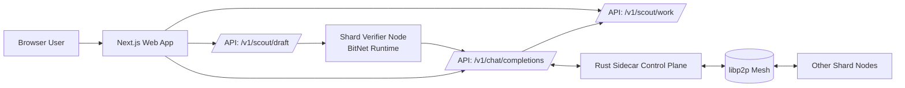

# Shard

Browser-powered distributed inference.

Shard lets visitors contribute WebGPU compute as Scout nodes, while Shard verifier nodes run stronger local models to validate/finalize outputs.

## Live Demo (February 17, 2026)

- Web app: `https://shard-trents-projects-20e9a51a.vercel.app`
- API (TLS): `https://54.224.107.75.nip.io`
- Browser scout transport (TLS): `wss://54.224.107.75.nip.io`

## What Users Do

- Open the website.
- Browser enters Scout mode by default and contributes WebGPU draft generation.
- If WebGPU is unavailable, browser falls back to leech/consumer mode.

Scout-first behavior is controlled by:

- `NEXT_PUBLIC_PREFER_LOCAL_SHARD=false` (default, recommended for public web)
- `NEXT_PUBLIC_PREFER_LOCAL_SHARD=true` (prefer localhost shard mode for power users/dev)

## Architecture (Current)


```mermaid
flowchart LR
    User[Browser User] --> Web[Next.js Web App]
    Web --> ChatAPI[/API: /v1/chat/completions/]

    ChatAPI --> WorkQ[/API: /v1/scout/work/]
    Web --> WorkQ
    Web --> DraftSubmit[/API: /v1/scout/draft/]
    DraftSubmit --> Verify[Shard Verifier Node\nBitNet Runtime]
    Verify --> ChatAPI

    ChatAPI <--> Sidecar[Rust Sidecar Control Plane]
    Sidecar <--> Mesh[(libp2p Mesh)]
    Mesh <--> Other[Other Shard Nodes]
```

Notes:
- Browser scout contribution currently uses API work polling + draft submission.
- Rust/libp2p mesh handles shard node networking and peer topology.
- Response readability depends on model + prompt format alignment.

## Response Quality (Readable Text)

For non-Llama-3 models (for example TinyLlama GGUF), set:

- `SHARD_PROMPT_FORMAT=plain`

For Llama-3 chat models, use:

- `SHARD_PROMPT_FORMAT=llama3` (or `auto` with matching model names)

## Real-World Examples

- Community AI endpoint with browser-contributed compute.
- Classroom/lab where student browsers act as Scouts and one lab workstation verifies.
- Hackathon demo: one EC2 verifier plus attendee browser Scouts.
- Internal overflow lane when centralized GPU budget is exhausted.

## Join As A Shard Node

Bootstrap peer (current):

```text
/ip4/54.224.107.75/tcp/4001/p2p/12D3KooWPTDTQBH5JTCxhiaZuL9sr695UAEndMDRj9SJ9pi3agEq
```

Linux quick start:

```bash
git clone https://github.com/TrentPierce/Shard.git
cd Shard/desktop/rust
cargo build --release
./target/release/shard-daemon \
  --control-port 9091 \
  --tcp-port 4001 \
  --webrtc-port 9090 \
  --quic-port 9092 \
  --bootstrap /ip4/54.224.107.75/tcp/4001/p2p/12D3KooWPTDTQBH5JTCxhiaZuL9sr695UAEndMDRj9SJ9pi3agEq
```

Run API + inference on the same node:

```bash
cd ../../desktop/python
python -m venv .venv
source .venv/bin/activate
pip install -r requirements.txt
BITNET_LIB=/path/to/libshard_engine.so \
BITNET_MODEL=/path/to/model.gguf \
SHARD_TESTING=0 \
SHARD_PROMPT_FORMAT=plain \
SHARD_REQUIRE_API_KEY=true \
SHARD_API_KEYS=<strong-key-list> \
python run.py --rust-url http://127.0.0.1:9091
```

Public IP in README:
- Acceptable for short-lived public demos.
- For long-term production, use a domain and restrict admin/control-plane access.

## Install From Downloaded Source

### Prerequisites
- Rust 1.75+
- Python 3.11+
- Node.js 18+

### Web

```bash
cd web
npm install
npm run dev
```

### Python API (source install)

```bash
cd desktop/python
python -m venv .venv
# Windows: .venv\Scripts\activate
# Linux/macOS: source .venv/bin/activate
pip install -r requirements.txt
python run.py --rust-url http://127.0.0.1:9091
```

### Rust daemon

```bash
cd desktop/rust
cargo build --release
./target/release/shard-daemon
```

## Python SDK Status

`python-sdk/` is currently an experimental scaffold. Install from source:

```bash
python -m venv .venv
# activate venv
cd python-sdk
pip install .
```

See `python-sdk/README.md` for current transport assumptions and limitations.

## Community

- Contributing guide: `CONTRIBUTING.md`
- Issues: `https://github.com/TrentPierce/Shard/issues`
- Discussions: `https://github.com/TrentPierce/Shard/discussions`

Issue templates are in `.github/ISSUE_TEMPLATE/`.
