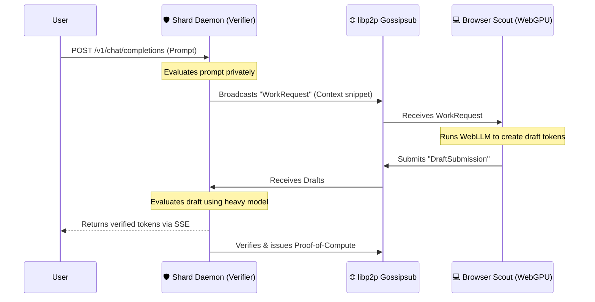

<div align="center">
  
  <h1>Shard Network</h1>
  <p><strong>The privacy-first, distributed inference network powered by speculative decoding and WebGPU.</strong></p>
</div>

[](https://github.com/TrentPierce/Shard/actions/workflows/ci.yml)
[](https://github.com/TrentPierce/Shard/releases/tag/v0.6.1)
[](https://opensource.org/licenses/MIT)


## What is Shard?

**Shard** is a novel architecture for running large language models across distributed networks of consumer hardware. Rather than slicing models into layers (which inherently exposes prompts to intermediary nodes), Shard utilizes **Speculative Decoding**.

In our network, lightweight browser-based nodes (**Scouts**) generate speculative "draft tokens". These draft tokens are routed via libp2p to high-powered verifier nodes, which use a high-fidelity bitnet model to verify the draft completely locally.

**Privacy Guarantee:** The initial prompt and final high-quality output never leave the primary **Verifier** hardware. Only speculative token chunks are sent over the P2P mesh network.

## The Architecture


```mermaid
sequenceDiagram
    participant User
    participant Verifier as 🛡️ Shard Daemon (Verifier)
    participant P2P as 🌐 libp2p Gossipsub
    participant Scout as 💻 Browser Scout (WebGPU)
    
    User->>Verifier: POST /v1/chat/completions (Prompt)
    Note over Verifier: Evaluates prompt privately
    Verifier->>P2P: Broadcasts "WorkRequest" (Context snippet)
    P2P->>Scout: Receives WorkRequest
    Note over Scout: Runs WebLLM to create draft tokens
    Scout->>P2P: Submits "DraftSubmission"
    P2P->>Verifier: Receives Drafts
    Note over Verifier: Evaluates draft using heavy model
    Verifier-->>User: Returns verified tokens via SSE
    Verifier->>P2P: Verifies & issues Proof-of-Compute
```

## Roles

The network has two main participants. Which one are you?

| Feature | 💻 **Browser Scout** | 🛡️ **Shard Verifier** |
| :--- | :--- | :--- |
| **Description** | Generates lightweight draft tokens speculatively. | Secures the network by serving requests and verifying drafts. |
| **Hardware** | Any modern laptop or PC with WebGPU support. | A dedicated server, Mac M1+, or PC with 16GB+ RAM. |
| **Install Type** | Zero-install. Runs entirely in your browser. | Desktop App / Background Daemon. |
| **Privacy** | Only sees scattered, tokenized context windows. | Holds the full context and generates the authentic responses. |
| **Telemetry** | Earns PoC (Proof-of-Compute) testnet points. | Runs the Ledger to issue testnet tokens and secure the mesh. |

## Quickstart

### Become a Scout
Want to contribute idle compute without installing anything? 
Head to **[shardnetwork.live](https://shardnetwork.live)** and click **Start**.

### Run a Verifier Node

#### One-Liner Install (macOS / Linux):
```bash
curl -sSL https://raw.githubusercontent.com/TrentPierce/Shard/main/install.sh | bash
```

Alternatively, download our desktop installers from the [Releases Page](https://github.com/TrentPierce/Shard/releases).

**Using Docker:**
```bash
docker build -f Dockerfile.daemon -t shard-daemon .
docker run -p 9091:9091 -p 4001:4001 -p 9090:9090/udp -p 9092:9092/udp shard-daemon --contribute
```

## Contributing

We welcome contributions! Please read our [Contributing Guidelines](docs/contributing.md) to get started.

- Read our [Versioning Strategy](docs/versioning.md) to understand how we keep the monorepo in sync.
- View the [Gateway API Specs](docs/api.md) for integrating applications.

## License
MIT License.
