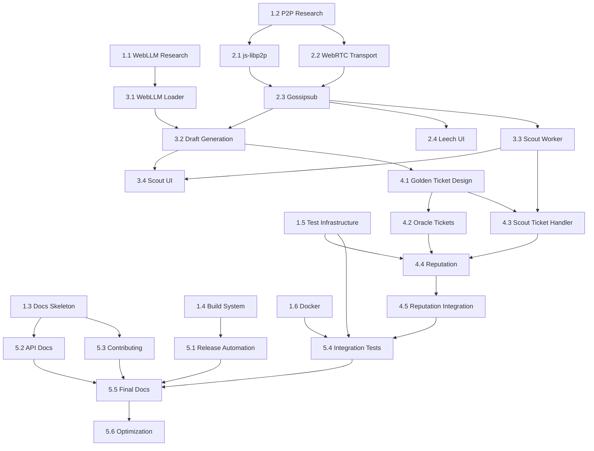

# Shard P2P Distributed LLM Network - Parallel Execution Plan

**Version:** 1.0  
**Date:** February 11, 2026  
**Estimated Duration:** 6-8 weeks (with full parallel execution)  

---

## Executive Summary

This plan breaks down the completion of the Shard P2P distributed LLM network into **5 waves of parallel execution**. Each wave contains tasks that can run simultaneously with minimal cross-dependencies. The plan leverages the category+skills delegation system to maximize throughput.

### Critical Path Analysis
```
Wave 1 (Foundation) → Wave 2 (Core P2P) → Wave 3 (WebLLM) → Wave 4 (Security) → Wave 5 (Release)
         ↓                    ↓                 ↓               ↓              ↓
    [All can run    [Leech UI can    [Golden Ticket  [Integration    [Final packaging
     in parallel]    start early]     needs Scout]    tests need all]  and docs]
```

---

## Current State Assessment

### ✅ Already Implemented (70% complete)
- Python Oracle API with FastAPI, OpenAI-compatible endpoints
- Rust P2P Daemon with libp2p, gossipsub, TCP/WebSocket transports
- Inference module with cooperative generation loop
- BitNet ctypes bridge for model loading
- Web client (Next.js) with chat UI, topology fetching
- Service worker scaffolding (needs completion)
- Basic test suite (pytest, cargo test)
- CI/CD GitHub Actions
- Docker setup

### ⚠️ Missing/Incomplete (30% remaining)
1. **WebLLM Integration** - Draft model loading in browser
2. **Complete Scout Runtime** - P2P connection via WebRTC
3. **Leech Mode UI** - Queue management and priority display
4. **Golden Ticket System** - Sybil resistance mechanism
5. **Reputation Scoring** - Trust management for Scouts
6. **WebRTC Browser-to-Network** - Complete P2P bridge
7. **Build Scripts** - Release automation
8. **Documentation** - API docs, contributing guide
9. **Distribution** - Installers and packages

---

## Wave 1: Foundation & Infrastructure (Week 1)

**Theme:** Prepare the groundwork for all subsequent work
**Parallelism:** All 6 tasks can run simultaneously
**Dependencies:** None (starts immediately)

### Task 1.1: WebLLM Research & Setup
- **File:** `web/src/lib/webllm.ts` (NEW)
- **Category:** `deep`
- **Skills:** None (research task)
- **Complexity:** Medium
- **Description:** 
  - Research WebLLM API patterns and model loading
  - Identify optimal draft models (TinyLlama, Phi-2, etc.)
  - Create WebLLM wrapper with error handling
  - Implement model caching strategy
- **Deliverables:**
  - `web/src/lib/webllm.ts` - WebLLM client wrapper
  - Model configuration constants
  - Loading state management
- **Blocking:** Tasks 3.1, 3.2, 3.3

### Task 1.2: P2P Browser Connection Research
- **Files:** `web/src/lib/p2p.ts` (NEW)
- **Category:** `deep`
- **Skills:** None
- **Complexity:** High
- **Description:**
  - Research js-libp2p browser integration
  - Investigate WebRTC-direct transport options
  - Design connection protocol for browser→daemon
  - Document WebSocket fallback strategy
- **Deliverables:**
  - `web/src/lib/p2p.ts` - P2P connection utilities (stub)
  - Protocol specification document
  - Connection flow diagrams
- **Blocking:** Tasks 2.1, 2.2, 2.3

### Task 1.3: Documentation Skeleton
- **Files:** `docs/` directory
- **Category:** `writing`
- **Skills:** None
- **Complexity:** Low
- **Description:**
  - Create documentation structure
  - Draft API documentation outline
  - Create CONTRIBUTING.md template
  - Draft deployment guide structure
- **Deliverables:**
  - `docs/api-reference.md` (outline)
  - `CONTRIBUTING.md` (template)
  - `docs/deployment-guide.md` (outline)
  - `docs/architecture.md` (diagram placeholder)
- **Blocking:** Tasks 5.2, 5.3, 5.4

### Task 1.4: Build System Enhancement
- **Files:** `scripts/build_release.py`, `package.json`
- **Category:** `unspecified-low`
- **Skills:** None
- **Complexity:** Low
- **Description:**
  - Enhance build_release.py with platform detection
  - Add versioning automation
  - Create build matrix for multiple platforms
  - Add artifact packaging
- **Deliverables:**
  - Enhanced `scripts/build_release.py`
  - Build matrix configuration
  - Version bump automation
- **Blocking:** Task 5.1

### Task 1.5: Test Infrastructure Expansion
- **Files:** `tests/`, `pytest.ini`, `.github/workflows/ci.yml`
- **Category:** `quick`
- **Skills:** None
- **Complexity:** Low
- **Description:**
  - Add WebLLM mocking utilities
  - Create P2P connection test helpers
  - Add integration test scaffolding
  - Expand CI to run browser tests
- **Deliverables:**
  - `tests/webllm_mock.py`
  - `tests/p2p_test_helpers.py`
  - Updated CI workflow
- **Blocking:** Tasks 4.4, 4.5, 4.6

### Task 1.6: Docker Production Setup
- **Files:** `Dockerfile`, `docker-compose.yml`
- **Category:** `unspecified-low`
- **Skills:** None
- **Complexity:** Medium
- **Description:**
  - Create multi-stage production Dockerfile
  - Add docker-compose for easy deployment
  - Configure volume mounts for models
  - Add health checks
- **Deliverables:**
  - `Dockerfile.prod`
  - `docker-compose.yml`
  - `.dockerignore` optimization
- **Blocking:** Tasks 4.4, 5.1

---

## Wave 2: P2P Core & Leech Mode (Week 1-2)

**Theme:** Complete P2P networking and Leech consumer experience
**Parallelism:** 5 tasks, mostly independent
**Dependencies:** Wave 1 completion (can start as Wave 1 tasks finish)

### Task 2.1: js-libp2p Browser Integration
- **Files:** `web/src/lib/p2p.ts`, `web/package.json`
- **Category:** `ultrabrain`
- **Skills:** None
- **Complexity:** High
- **Description:**
  - Integrate js-libp2p for browser P2P
  - Implement WebSocket transport (fallback)
  - Create peer discovery mechanism
  - Handle connection lifecycle (connect/disconnect/reconnect)
- **Deliverables:**
  - `web/src/lib/p2p.ts` - Full P2P client
  - Peer connection manager
  - Message router for gossipsub
- **Blocking:** Tasks 2.2, 2.3, 3.2
- **Depends on:** Task 1.2

### Task 2.2: WebRTC-Direct Transport (Rust)
- **Files:** `desktop/rust/src/main.rs`, `desktop/rust/Cargo.toml`
- **Category:** `ultrabrain`
- **Skills:** None
- **Complexity:** Very High
- **Description:**
  - Add WebRTC-direct transport to Rust daemon
  - Configure STUN/TURN servers
  - Implement signaling protocol
  - Handle NAT traversal
- **Deliverables:**
  - Updated `main.rs` with WebRTC support
  - Signaling endpoint in control plane
  - ICE configuration management
- **Blocking:** Task 2.1
- **Depends on:** Task 1.2

### Task 2.3: Gossipsub Browser Participation
- **Files:** `web/src/lib/p2p.ts`, `web/public/swarm-worker.js`
- **Category:** `ultrabrain`
- **Skills:** None
- **Complexity:** High
- **Description:**
  - Subscribe browser to gossipsub topics
  - Implement message serialization
  - Create work broadcast handler
  - Add result submission path
- **Deliverables:**
  - Gossipsub topic handlers
  - Message codec for browser↔daemon
  - Work result submission API
- **Blocking:** Tasks 2.4, 3.2
- **Depends on:** Tasks 2.1, 2.2

### Task 2.4: Leech Mode UI Implementation
- **Files:** `web/src/components/LeechPanel.tsx`, `web/src/app/page.tsx`
- **Category:** `visual-engineering`
- **Skills:** `frontend-ui-ux`
- **Complexity:** Medium
- **Description:**
  - Create Leech mode UI component
  - Implement queue position display
  - Add "Enable Scout Mode" upsell
  - Show estimated wait time
  - Display priority tier information
- **Deliverables:**
  - `web/src/components/LeechPanel.tsx`
  - Queue state management hooks
  - Priority visualization
- **Blocking:** None
- **Depends on:** Task 2.3 (for connection status)

### Task 2.5: Traffic Shaping & Priority System
- **Files:** `desktop/python/oracle_api.py`, `desktop/rust/src/main.rs`
- **Category:** `ultrabrain`
- **Skills:** None
- **Complexity:** Medium
- **Description:**
  - Implement load-based queue management
  - Create priority tiers (Oracle > Scout > Leech)
  - Add swarm load endpoint
  - Implement dynamic priority adjustment
- **Deliverables:**
  - Priority queue implementation
  - Load calculation algorithm
  - Dynamic routing logic
- **Blocking:** Task 2.4
- **Depends on:** None

---

## Wave 3: Scout Mode & WebLLM (Week 2-3)

**Theme:** Enable browser-based draft generation
**Parallelism:** 4 tasks with some dependencies
**Dependencies:** Wave 2 completion for P2P connectivity

### Task 3.1: WebLLM Model Loader
- **Files:** `web/src/lib/webllm.ts`
- **Category:** `deep`
- **Skills:** None
- **Complexity:** High
- **Description:**
  - Implement model download progress tracking
  - Create model cache management
  - Add GPU capability detection
  - Handle WebGPU initialization errors
- **Deliverables:**
  - Model loading UI component
  - Progress callback system
  - Cache invalidation logic
- **Blocking:** Tasks 3.2, 3.3, 3.4
- **Depends on:** Task 1.1

### Task 3.2: Draft Token Generation
- **Files:** `web/src/lib/draft.ts`, `web/src/lib/p2p.ts`
- **Category:** `ultrabrain`
- **Skills:** None
- **Complexity:** High
- **Description:**
  - Implement speculative decoding in browser
  - Create draft generation loop
  - Handle token streaming
  - Add generation quality metrics
- **Deliverables:**
  - `web/src/lib/draft.ts` - Draft generator
  - Token streaming interface
  - Generation statistics tracker
- **Blocking:** Tasks 3.3, 3.4, 4.1
- **Depends on:** Tasks 1.1, 2.1, 2.3, 3.1

### Task 3.3: Scout Service Worker Completion
- **Files:** `web/public/swarm-worker.js`, `web/src/lib/swarm.ts`
- **Category:** `ultrabrain`
- **Skills:** None
- **Complexity:** High
- **Description:**
  - Complete service worker P2P integration
  - Implement work coordination
  - Add background draft generation scheduling
  - Handle browser lifecycle events (freeze/thaw)
- **Deliverables:**
  - Complete `swarm-worker.js` implementation
  - Work scheduling algorithm
  - Lifecycle event handlers
- **Blocking:** Tasks 3.4, 4.1
- **Depends on:** Tasks 2.3, 3.2

### Task 3.4: Scout Mode UI
- **Files:** `web/src/components/ScoutPanel.tsx`, `web/src/components/Header.tsx`
- **Category:** `visual-engineering`
- **Skills:** `frontend-ui-ux`
- **Complexity:** Medium
- **Description:**
  - Create Scout mode dashboard
  - Show contribution statistics (tokens generated, verified)
  - Display network participation metrics
  - Add model loading progress indicator
  - Show earnings/free tier progress
- **Deliverables:**
  - `web/src/components/ScoutPanel.tsx`
  - Contribution statistics display
  - Network status visualization
- **Blocking:** None
- **Depends on:** Tasks 3.2, 3.3

---

## Wave 4: Security & Reputation (Week 3-4)

**Theme:** Implement Sybil resistance and trust management
**Parallelism:** 4 tasks with interdependencies
**Dependencies:** Wave 3 completion for Scout functionality

### Task 4.1: Golden Ticket System Design
- **Files:** `docs/security/golden-tickets.md`, `desktop/python/inference.py`
- **Category:** `ultrabrain`
- **Skills:** None
- **Complexity:** Very High
- **Description:**
  - Design golden ticket generation algorithm
  - Create cryptographically verifiable tickets
  - Implement injection strategy (random/frequency)
  - Design ticket validation flow
- **Deliverables:**
  - Security specification document
  - Golden ticket data structure
  - Injection algorithm design
- **Blocking:** Tasks 4.2, 4.3
- **Depends on:** Task 3.2

### Task 4.2: Golden Ticket Implementation (Oracle)
- **Files:** `desktop/python/inference.py`, `desktop/python/oracle_api.py`
- **Category:** `ultrabrain`
- **Skills:** None
- **Complexity:** High
- **Description:**
  - Implement ticket generation in Oracle
  - Add ticket injection to cooperative_generate
  - Create ticket signature verification
  - Add ticket result validation
- **Deliverables:**
  - Golden ticket generator
  - Injection logic in inference loop
  - Signature verification module
- **Blocking:** Tasks 4.4, 4.5
- **Depends on:** Task 4.1

### Task 4.3: Golden Ticket Handling (Scout)
- **Files:** `web/src/lib/draft.ts`, `web/public/swarm-worker.js`
- **Category:** `ultrabrain`
- **Skills:** None
- **Complexity:** High
- **Description:**
  - Detect golden tickets in draft generation
  - Submit ticket responses
  - Handle ticket failure (temporary ban)
  - Implement ticket success reporting
- **Deliverables:**
  - Ticket detection logic
  - Response submission handler
  - Ban state management
- **Blocking:** Tasks 4.4, 4.5
- **Depends on:** Task 4.1

### Task 4.4: Reputation Scoring System
- **Files:** `desktop/rust/src/reputation.rs` (NEW), `desktop/rust/src/main.rs`
- **Category:** `ultrabrain`
- **Skills:** None
- **Complexity:** High
- **Description:**
  - Design reputation scoring algorithm
  - Implement peer reputation tracking
  - Create reputation-based routing
  - Add reputation decay/increase mechanics
- **Deliverables:**
  - `desktop/rust/src/reputation.rs`
  - Reputation database schema
  - Score calculation engine
- **Blocking:** Tasks 4.5, 4.6
- **Depends on:** Tasks 1.6, 4.2, 4.3

### Task 4.5: Reputation Integration
- **Files:** `desktop/rust/src/main.rs`, `desktop/python/inference.py`
- **Category:** `ultrabrain`
- **Skills:** None
- **Complexity:** Medium
- **Description:**
  - Integrate reputation into work routing
  - Add reputation-based draft acceptance
  - Implement reputation penalties
  - Create reputation recovery mechanism
- **Deliverables:**
  - Reputation-aware routing
  - Penalty enforcement
  - Recovery protocol
- **Blocking:** Task 4.6
- **Depends on:** Tasks 4.2, 4.3, 4.4

### Task 4.6: Security Testing
- **Files:** `tests/security_test.py`, `tests/golden_ticket_test.py`
- **Category:** `unspecified-high`
- **Skills:** None
- **Complexity:** Medium
- **Description:**
  - Create golden ticket unit tests
  - Add reputation system tests
  - Implement Sybil attack simulation
  - Add fuzzing for security boundaries
- **Deliverables:**
  - `tests/golden_ticket_test.py`
  - `tests/reputation_test.py`
  - Attack simulation suite
- **Blocking:** None
- **Depends on:** Tasks 1.5, 4.2, 4.3, 4.4, 4.5

---

## Wave 5: Documentation, Testing & Release (Week 4-6)

**Theme:** Polish, document, and ship
**Parallelism:** 4 tasks with some dependencies
**Dependencies:** Waves 1-4 completion

### Task 5.1: Build & Release Automation
- **Files:** `scripts/`, `.github/workflows/release.yml`
- **Category:** `unspecified-low`
- **Skills:** None
- **Complexity:** Medium
- **Description:**
  - Create GitHub Actions release workflow
  - Add binary signing (optional)
  - Implement installer generation
  - Create release notes automation
- **Deliverables:**
  - `.github/workflows/release.yml`
  - Installer scripts for Windows/Mac/Linux
  - Release automation
- **Blocking:** Task 5.4
- **Depends on:** Tasks 1.4, 1.6

### Task 5.2: API Documentation
- **Files:** `docs/api-reference.md`, `docs/openapi.yaml`
- **Category:** `writing`
- **Skills:** None
- **Complexity:** Medium
- **Description:**
  - Complete OpenAPI specification
  - Document all endpoints with examples
  - Add authentication guide
  - Create SDK usage examples
- **Deliverables:**
  - `docs/openapi.yaml`
  - `docs/api-reference.md`
  - Code examples
- **Blocking:** None
- **Depends on:** Task 1.3

### Task 5.3: Contributing Guide & Developer Docs
- **Files:** `CONTRIBUTING.md`, `docs/development.md`
- **Category:** `writing`
- **Skills:** None
- **Complexity:** Low
- **Description:**
  - Write comprehensive contributing guide
  - Document development setup
  - Add architecture decision records
  - Create troubleshooting guide
- **Deliverables:**
  - `CONTRIBUTING.md`
  - `docs/development.md`
  - `docs/architecture-decisions/`
- **Blocking:** None
- **Depends on:** Task 1.3

### Task 5.4: Integration Testing Suite
- **Files:** `tests/integration/`, `.github/workflows/integration.yml`
- **Category:** `unspecified-high`
- **Skills:** None
- **Complexity:** High
- **Description:**
  - Create end-to-end integration tests
  - Test Oracle→Scout→Leech flow
  - Add load testing scenarios
  - Implement chaos testing
- **Deliverables:**
  - `tests/integration/test_full_flow.py`
  - Load testing suite
  - CI integration test job
- **Blocking:** None
- **Depends on:** Tasks 1.5, 4.6, 5.1

### Task 5.5: Final README & Marketing Docs
- **Files:** `README.md`, `docs/`
- **Category:** `writing`
- **Skills:** None
- **Complexity:** Low
- **Description:**
  - Polish README with badges and demos
  - Add quickstart video/GIF
  - Write announcement blog post
  - Create feature comparison table
- **Deliverables:**
  - Updated `README.md`
  - Marketing materials
  - Release announcement
- **Blocking:** None
- **Depends on:** All previous tasks

### Task 5.6: Performance Optimization
- **Files:** Various
- **Category:** `ultrabrain`
- **Skills:** None
- **Complexity:** High
- **Description:**
  - Profile and optimize hot paths
  - Add caching layers
  - Optimize P2P message routing
  - Improve WebLLM loading performance
- **Deliverables:**
  - Performance benchmarks
  - Optimization report
  - Updated performance-critical code
- **Blocking:** None
- **Depends on:** All previous tasks

---

## Task Dependency Graph



---

## Resource Allocation Recommendations

### Recommended Team Structure (6 developers)

| Developer | Primary Focus | Categories | Waves |
|-----------|--------------|------------|-------|
| **Dev 1** | Rust/Core P2P | `ultrabrain` | 1.2, 2.2, 2.3, 4.4, 4.5 |
| **Dev 2** | WebLLM/Browser | `deep`, `ultrabrain` | 1.1, 3.1, 3.2, 3.3, 4.3 |
| **Dev 3** | Frontend/UI | `visual-engineering` | 2.4, 3.4, 5.2 |
| **Dev 4** | Python/Oracle | `ultrabrain` | 4.1, 4.2, 4.6 |
| **Dev 5** | DevOps/Build | `unspecified-low` | 1.4, 1.6, 5.1, 5.4 |
| **Dev 6** | Documentation/Tests | `writing`, `unspecified-high` | 1.3, 1.5, 5.3, 5.5 |

### Solo Developer Strategy

If you're working alone, follow this sequence:

1. **Week 1:** Tasks 1.1, 1.2, 1.5 (research + tests)
2. **Week 2:** Tasks 2.1, 2.2, 2.4 (P2P + UI)
3. **Week 3:** Tasks 3.1, 3.2, 3.4 (WebLLM + UI)
4. **Week 4:** Tasks 4.1, 4.2, 4.4 (Security core)
5. **Week 5:** Tasks 4.3, 4.5, 4.6 (Security integration)
6. **Week 6:** Tasks 5.1-5.6 (release prep)

---

## Risk Assessment & Mitigation

### High-Risk Tasks

| Task | Risk | Mitigation |
|------|------|------------|
| 2.2 WebRTC Transport | Complex, may not work on all platforms | Have WebSocket fallback ready |
| 4.1-4.3 Golden Tickets | Security-critical, needs audit | Start with simple implementation, iterate |
| 3.2 Draft Generation | WebLLM may have compatibility issues | Test early on target browsers |
| 2.1 js-libp2p | Browser P2P is complex | Use established patterns, test thoroughly |

### Critical Path Risks

1. **WebRTC Blockers:** If WebRTC-direct doesn't work, pivot to WebSocket-only
2. **WebLLM Performance:** If too slow, reduce draft token count
3. **Security Complexity:** Defer advanced Sybil resistance to v2

---

## Success Criteria

### Minimum Viable Product (MVP)
- [ ] Oracle node runs and accepts connections
- [ ] Scout mode generates draft tokens via WebLLM
- [ ] Leech mode shows queue and receives responses
- [ ] Basic P2P connectivity (WebSocket acceptable)
- [ ] Golden ticket system functional
- [ ] All tests passing

### Production Ready
- [ ] WebRTC-direct working
- [ ] Reputation system active
- [ ] Full documentation complete
- [ ] Release automation working
- [ ] Docker images published
- [ ] Load testing passed

---

## Next Steps

1. **Review this plan** with stakeholders
2. **Assign developers** to task categories
3. **Start Wave 1** immediately (no dependencies)
4. **Set up tracking** (GitHub Projects/Jira) with these tasks
5. **Schedule weekly sync** to adjust based on progress

---

## Appendix A: File Structure After Completion

```
shard/
├── desktop/
│   ├── python/
│   │   ├── oracle_api.py
│   │   ├── inference.py
│   │   ├── bitnet/
│   │   │   ├── __init__.py
│   │   │   └── ctypes_bridge.py
│   │   └── golden_ticket.py          # NEW
│   └── rust/
│       ├── src/
│       │   ├── main.rs
│       │   ├── reputation.rs         # NEW
│       │   └── webrtc.rs             # NEW
│       └── Cargo.toml
├── web/
│   ├── src/
│   │   ├── app/
│   │   │   ├── page.tsx
│   │   │   └── layout.tsx
│   │   ├── components/
│   │   │   ├── ChatPanel.tsx
│   │   │   ├── Header.tsx
│   │   │   ├── NetworkStatus.tsx
│   │   │   ├── LeechPanel.tsx        # NEW
│   │   │   └── ScoutPanel.tsx        # NEW
│   │   └── lib/
│   │       ├── swarm.ts
│   │       ├── api.ts
│   │       ├── webllm.ts             # NEW
│   │       ├── p2p.ts                # NEW
│   │       └── draft.ts              # NEW
│   ├── public/
│   │   └── swarm-worker.js           # COMPLETE
│   └── package.json
├── tests/
│   ├── oracle_api_security_test.py
│   ├── inference_unit_test.py
│   ├── inference_benchmark.py
│   ├── golden_ticket_test.py         # NEW
│   ├── reputation_test.py            # NEW
│   └── integration/                  # NEW
│       └── test_full_flow.py
├── docs/
│   ├── api-reference.md              # COMPLETE
│   ├── deployment-guide.md           # COMPLETE
│   ├── contributing.md               # NEW
│   ├── architecture.md               # NEW
│   └── security/
│       └── golden-tickets.md         # NEW
├── scripts/
│   ├── build_release.py              # ENHANCED
│   └── install/                      # NEW
│       ├── windows.ps1
│       ├── mac.sh
│       └── linux.sh
├── .github/
│   └── workflows/
│       ├── ci.yml
│       └── release.yml               # NEW
├── Dockerfile.prod                   # NEW
├── docker-compose.yml                # NEW
└── README.md                         # POLISHED
```

---

## Appendix B: Technology Stack Summary

| Component | Technology | Version |
|-----------|-----------|---------|
| Oracle API | Python + FastAPI | 3.11+ |
| P2P Daemon | Rust + libp2p | 1.75+ |
| Web Client | Next.js + React | 14.x |
| WebLLM | @mlc-ai/web-llm | 0.2.78+ |
| P2P Browser | js-libp2p | latest |
| BitNet | bitnet.cpp | compatible |
| Container | Docker | 24.x+ |

---

*End of Parallel Execution Plan*
