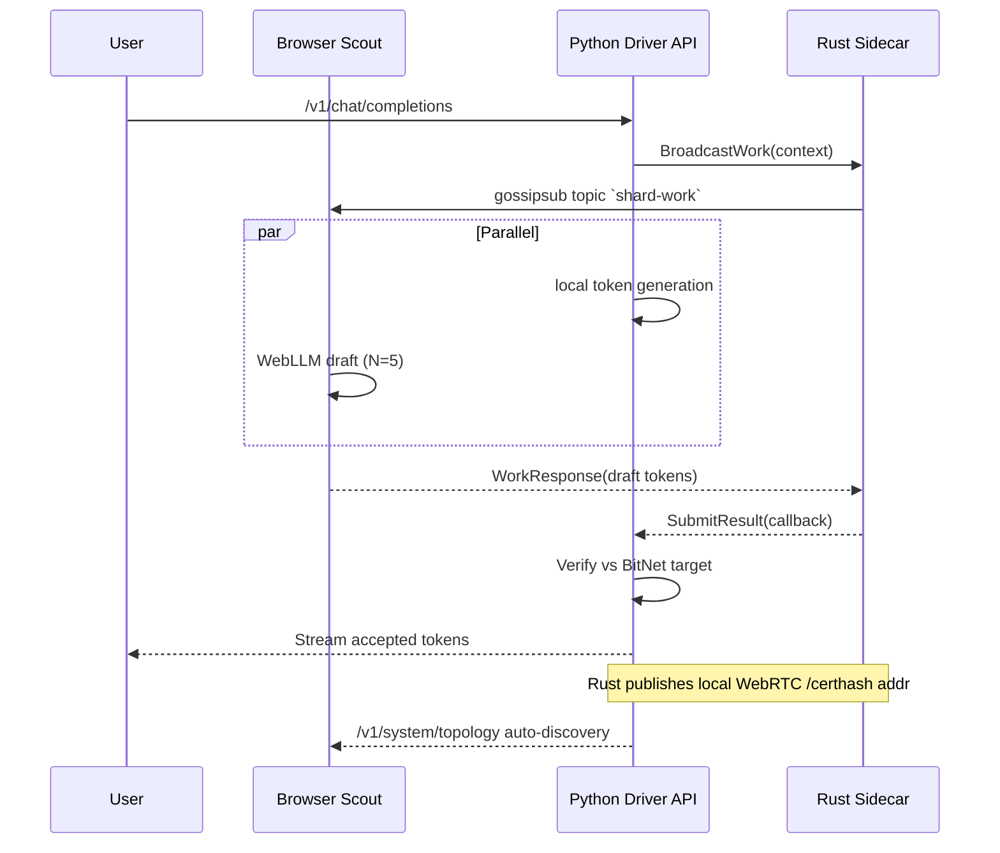

# System Diagram

```mermaid
sequenceDiagram
    participant User
    participant Browser as Browser Scout
    participant Python as Python Driver API
    participant Rust as Rust Sidecar

    User->>Python: /v1/chat/completions
    Python->>Rust: BroadcastWork(context)
    Rust->>Browser: gossipsub topic `shard-work`

    par Parallel
      Python->>Python: local token generation
      Browser->>Browser: WebLLM draft (N=5)
    end

    Browser-->>Rust: WorkResponse(draft tokens)
    Rust-->>Python: SubmitResult(callback)
    Python->>Python: Verify vs BitNet target
    Python-->>User: Stream accepted tokens

    Note over Rust,Python: Rust publishes local WebRTC /certhash addr
    Python-->>Browser: /v1/system/topology auto-discovery
```
